# Karteikarten

## Table of Contents

 + [Introduction](#introduction)
 + [Features](#features)
    - [Info Overlay](#info-overlay)
    - [Countdown](#countdown)
    - [Categories](#categories)
    - [Help Tools](#help-tools)
    - [Success Markers](#success-markers)
    - [Mini Reviews](#mini-reviews)
    - [Final Review](#final-review)
    - [Curated Decks](#curated-decks)
    - [Colorful Chameleon](#colorful-chameleon)
 + [Mobile Version](#mobile-version)
 + [Favicon](#favicon)
 + [Inspiration](#inspiration)
 + [Tech Specs](#tech-specs)
 
## Introduction

 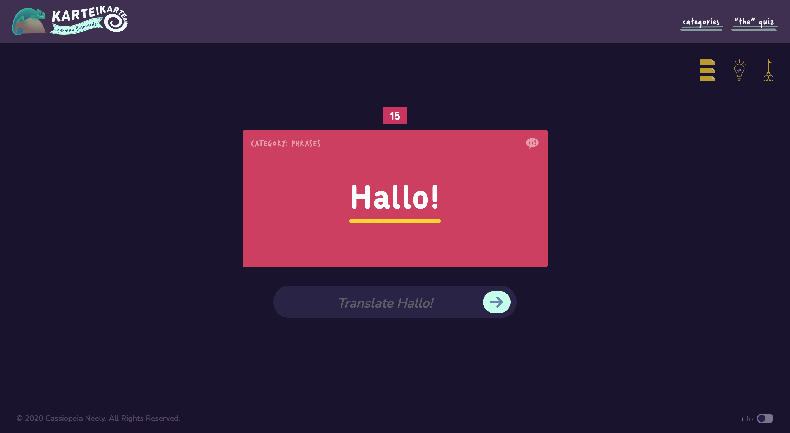

 *Hallo!* [Karteikarten](https://cassiopeian.github.io/Karteikarten/) (literally, "flashcards," or "index cards") is a supplementary learning tool, intended to strengthen beginners’ German-language vocabulary skills. 
 
 Organized into ten levels of increasing difficulty, Karteikarten features more than 300 German to English flashcards, color-coordinated by category. 
 
 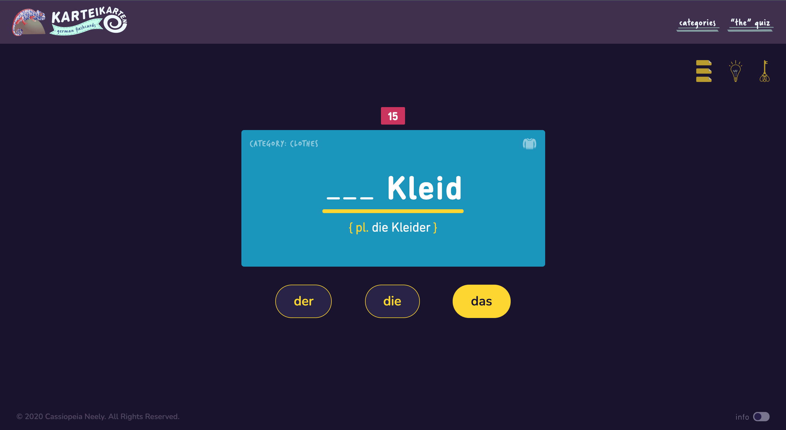

 Switch over to “The” Quiz to test knowledge of *Geschlecht*, “gender,” by filling in the flashcard blanks with *der*, *die*, or *das*.

## Features

 ### Info Overlay

 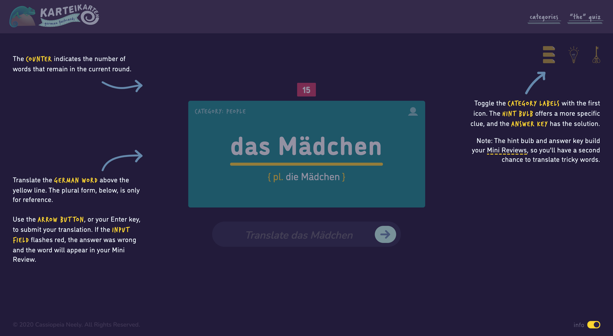

 Toggle the *Info* switch, at the bottom of the page, to see brief summaries of the site's features. Hint: Click on *Mini Reviews*, underlined with yellow dashes, to watch a video example of a Mini Review.

 ### Countdown

 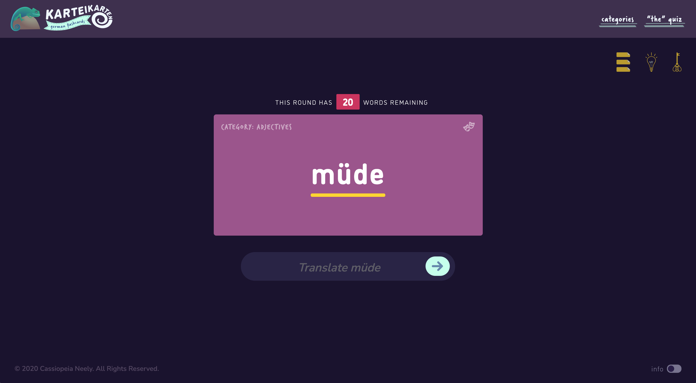

 ### Categories

 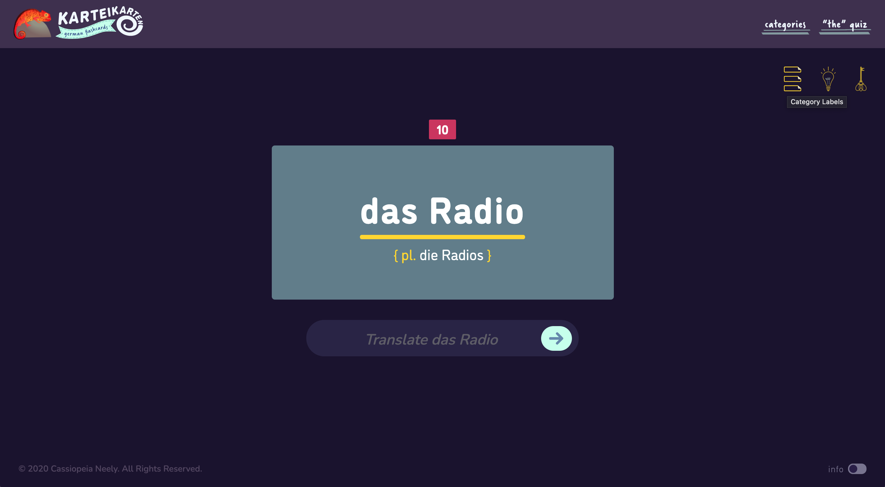

 Each flashcard belongs to one of more than a dozen color-coordinated categories, to help Karteikarten users build mental associations. 

 The word *die Sonne* (the sun) appears in the green Nature deck, while *der Sohn* (the son) is in the teal People deck. Likewise, *die Frucht* (the fruit), a botanical term, belongs to the Nature deck, whereas *das Obst* (the fruit), found in a local supermarket, belongs to the red Food deck.

 For colorblind users, the flashcards also state the name of category they belong to, along with an illustrated visual cue.

 This feature can be turned off by clicking the *Category Labels* icon, next to the help tools. When the labels are hidden, the *Category Labels* icon switches to an outline of itself.

 ### Help Tools

 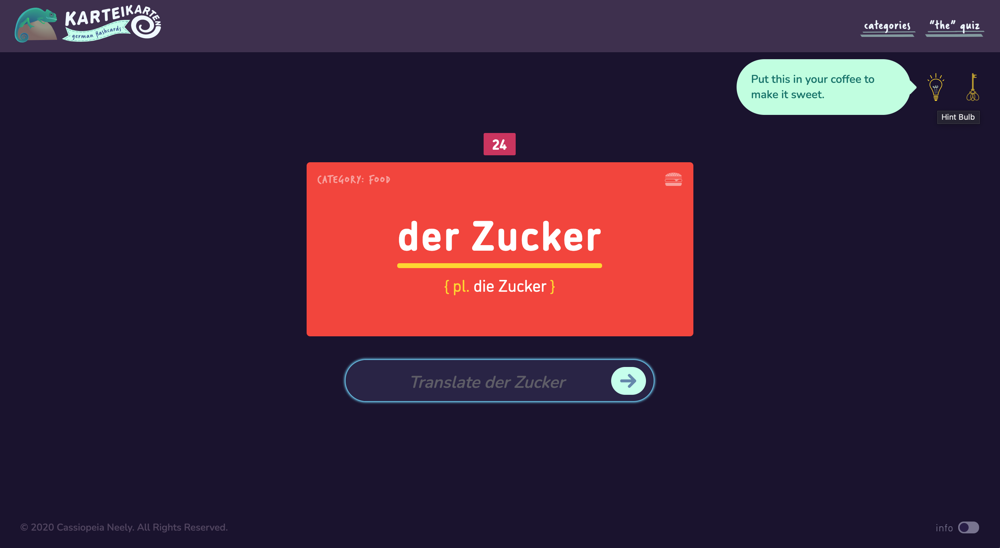

 If you find yourself drawing a blank, don’t worry! Use the help tools.
 + *Hint Bulb* — Reveals a clue in a green speech bubble.
 + *Answer Key* — Populates the input with the correct translation.

 ### Success Markers

 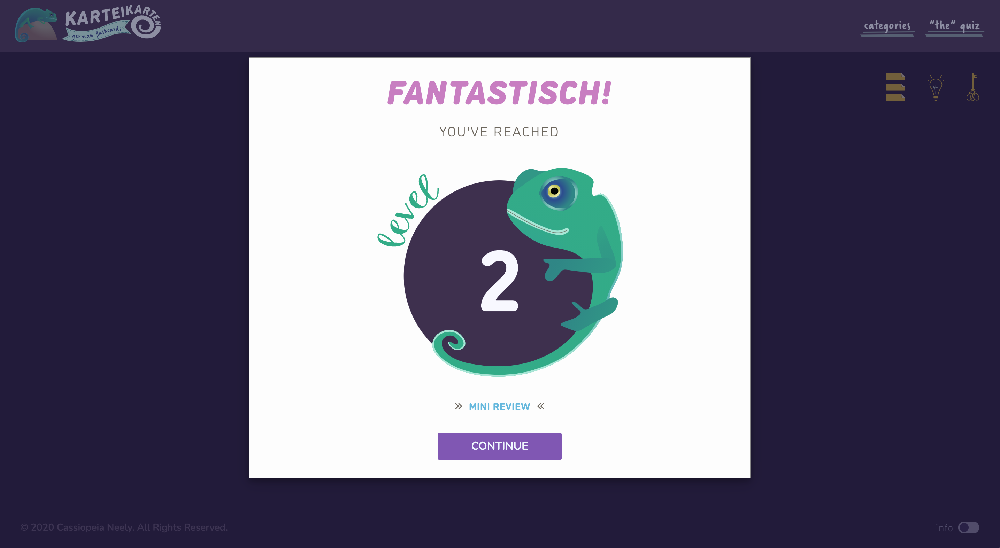

 As you progress, the levels get longer and the words get trickier, but Flash will always congratulate you when you successfully complete a batch of flashcards. If you use any of the help tools during a round, you’ll see a *Mini Review* link on your checkpoint notification.

 ### Mini Reviews

 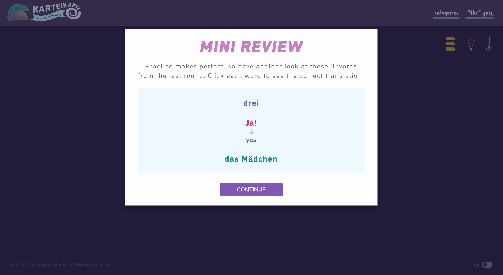

 Any word you solve with the assistance of the *Hint Bulb* or *Answer Key* will be added to your end-of-round Mini Review. These optional reviews give you an opportunity to quiz yourself until you feel confident.
 + Think about your review words, presented in their category colors
 + When you're ready to see the correct translations, click each word 
 + To hide the translations, and try again, click the words a second time

 ### Final Review

 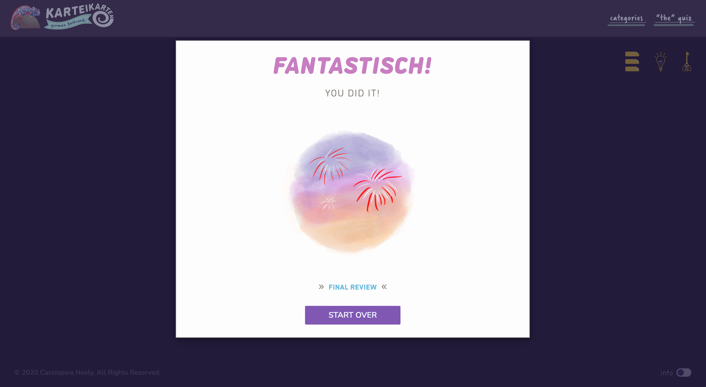

 Enjoy the animated fireworks, when you reach the end of the flashcard deck! Then, click the *Final Review* link, to see a compilation of all your Mini Review words.

 ### Curated Decks

 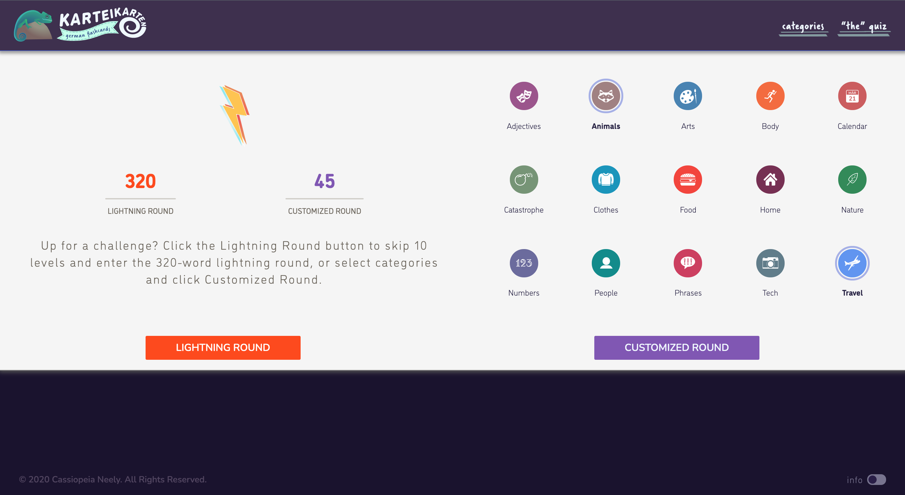

 Click the *Categories* button, to reveal a hidden panel where you can curate a customized deck of flashcards, or challenge yourself with the lightning round. 

 #### Interactive Number Display
 The orange number displays the amount of flashcards in the lightning round, and the purple one represents the number of flashcards in any customized round you build. The purple figure will increase or decrease depending on how many categories you select.

 #### Visible Category Selection
 The icons of the categories you’ve selected will be purple-ringed, and the category name will turn bold.

 ### Colorful Chameleon

   

 Keep an eye on the chameleon, Flash, up in the top left corner. Each time you progress to the next flashcard, he’ll change colors.

## Mobile Version

       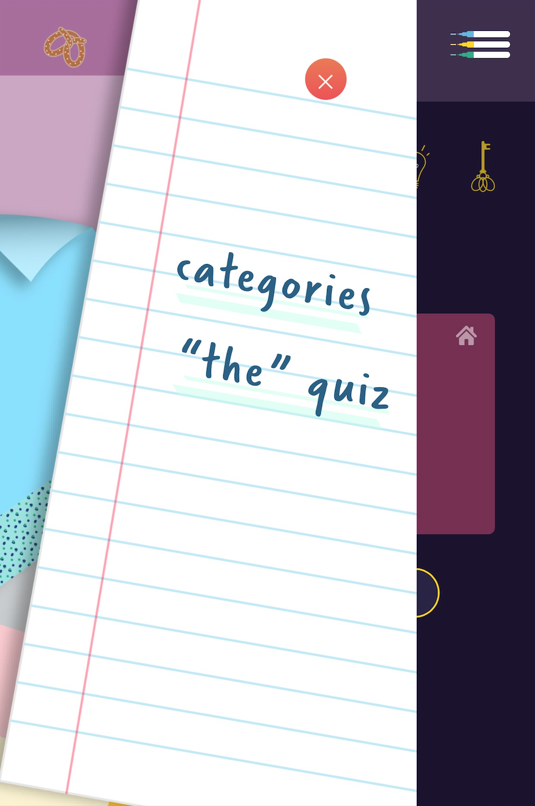

 In the mobile version, the navigation links are replaced by a hamburger menu shaped like three highlighters. When the menu is clicked, the highlighters slide to the right, and appear to draw three lines, as the navigation panel sweeps across the page.

## Favicon

 

 The Karteikarten favicon was designed to be a flag—in more ways than one. Sporting the hues of the German tricolor, the K-shaped (for *Karteikarten*) symbol is also meant to represent the kind of colorful, adhesive page flags one might use while studying.

## Inspiration

 If you don’t learn a noun’s gender in the nominative case—when the noun is the subject—it becomes harder to express yourself in the accusative (direct object), dative (indirect object), and genitive (possessive) cases. Furthermore, gender can change a noun’s meaning. For example, *__die__ Leiter* means “the ladder,” while *__der__ Leiter* means “the leader.”

 Free language-learning apps, like Duolingo, don’t offer flashcards, and I realized the lessons weren’t enough to help me retain noun genders. I created Karteikarten to improve my German-language vocabulary, so I would have better confidence constructing complex sentences.

## Tech Specs

 Karteikarten was built with jQuery version 3.4.1.